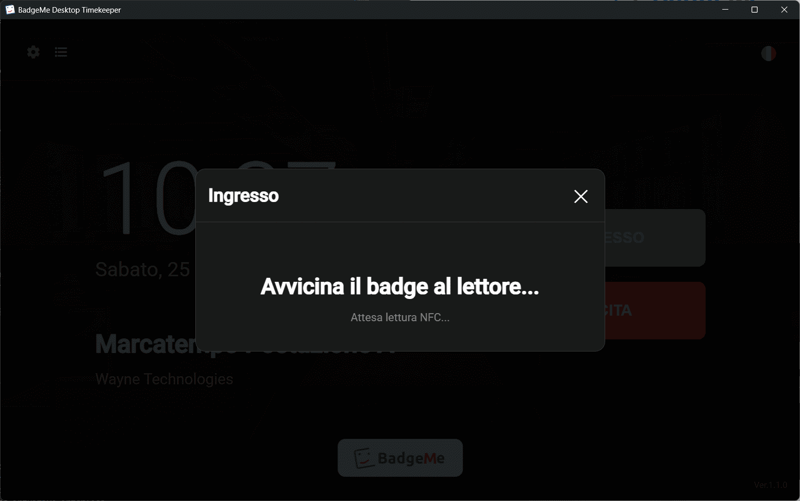

  

# Marcatempo BadgeMe per PC

🇬🇧 [English](README.md) | 🇮🇹 Italiano

Marcatempo dipendenti gratis per PC Windows, semplice e pronto all’uso.  
Software marcatempo desktop per timbrare entrate e uscite e gestire le presenze in modo immediato.

👉 Crea un account gratuito BadgeMe: <https://www.badgemeweb.com>

⚠️ Richiede attivazione dal pannello BadgeMe

---

  

---

## 🧭 Panoramica

BadgeMe Desktop Timekeeper è un software di rilevazione presenze che permette ai dipendenti di timbrare direttamente da PC.

È pensato per aziende che vogliono gestire le presenze in modo semplice, senza sistemi complessi o costosi.

✔ 100% gratuito (freeware)
✔ Compatibile con BadgeMe
✔ Facile da usare
✔ Ideale per piccole aziende e uffici

---

## 🚀 Funzionalità

- Timbratura entrata e uscita dipendenti
- Rilevazione presenze
- Registrazione ore lavorate
- Sistema badge digitale
- Interfaccia semplice e intuitiva
- Utilizzo da PC Windows
- Autenticazione tramite codice (PIN)
- Supporto badge NFC (lettori compatibili PC/SC)

---

## 🔐 Attivazione

Per utilizzare il software è necessario attivare il marcatempo dal servizio di rilevazioni presenze BadgeMe.

1. Crea un account gratuito su <https://www.badgemeweb.com>

2. Crea la tua organizzazione.

3. Crea i badge della tua organizzazione.

4. Configura un nuovo marcatempo dal pannello.

5. Ottieni il codice di attivazione (licenza).

6. Inserisci il codice nel marcatempo BadgeMe per PC.  

Dopo l’attivazione, i dipendenti possono iniziare a timbrare.

Per qualsiasi domande o supporto contatteci su [info@badgemeweb.com](mailto:info@badgemeweb.com)

---

## 🔗 Integrazione con BadgeMe

Il software funziona con BadgeMe, sistema di gestione presenze online.

Con BadgeMe puoi:

- monitorare le presenze dei dipendenti
- gestire ingressi e uscite
- gestire turni altamente personalizzabili
- gestire pause, straordinari, notturni
- calcolare le ore lavorate
- esportare report mensili
- comunicazioni private
- gestire permessi e ferie
- suddivisione in reparti, supervisori, responsabili

👉 Crea un account gratuito: <https://dashboard.badgemeweb.com>
👉 Scopri di più: <https://badgemeweb.com>

---

## 📡 Supporto NFC

Il marcatempo supporta l’autenticazione tramite badge NFC.

È compatibile con tutti i lettori NFC USB che supportano lo standard PC/SC.

Questo consente ai dipendenti di timbrare in modo rapido e sicuro utilizzando badge contactless.

  

---

## 🚀 Inizia subito

1. Crea un account gratuito su BadgeMe
2. Configura il marcatempo e ottieni il codice
3. Scarica il software dalla sezione Releases
4. Inserisci il codice e inizia a timbrare

---

## 📥 Download

Scarica l’ultima versione dalla [sezione Releases](https://github.com/BabuinoControllers/badgeme-marcatempo-windows/releases/latest).

---

## ⚙️ Requisiti minimi

- PC Windows 10
- Account BadgeMe (piano gratuito disponibile)

---

## 📄 Licenza

Questo software è distribuito come freeware.

È consentito:

- utilizzare il software gratuitamente

Non è consentito:

- modificare o decompilare il software
- ridistribuirlo senza autorizzazione
- venderlo

---

## 📬 Supporto

Per domande o supporto:

📧 [info@badgemeweb.com](mailto:info@badgemeweb.com)

🌐 <https://www.badgemeweb.com>
