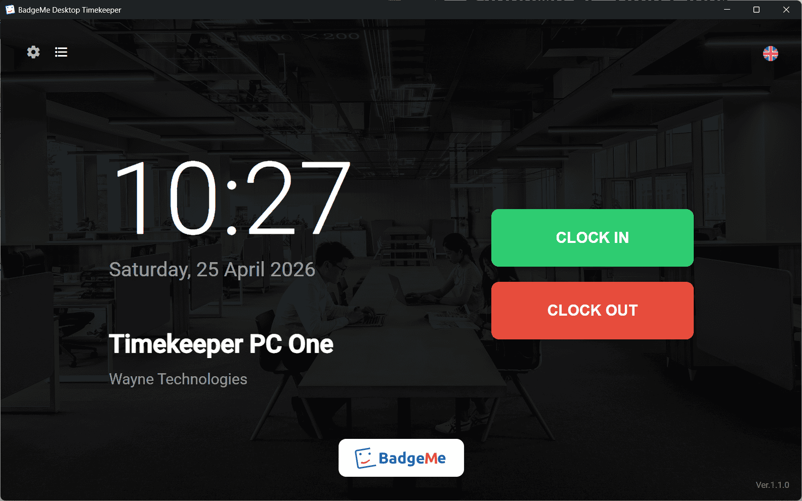
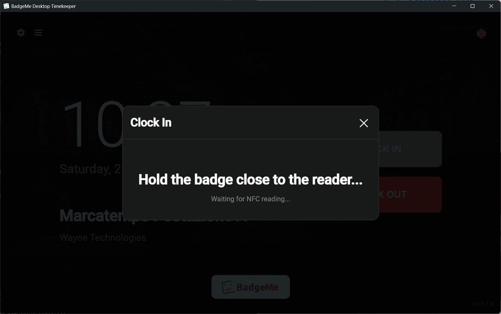

  

# BadgeMe Time Clock for PC

🇬🇧 English | 🇮🇹 [Italiano](README.it.md)

Free employee time clock for Windows PC, simple and ready to use.  
Desktop time clock software to clock in and out and manage attendance immediately.

👉 Create a free BadgeMe account: <https://www.badgemeweb.com>

⚠️ Requires activation via the BadgeMe dashboard

---

  

---

## 🧭 Overview

BadgeMe Desktop Timekeeper is an attendance tracking software that allows employees to clock in directly from a PC.

It is designed for companies that want to manage attendance in a simple way, without complex or expensive systems.

✔ 100% free (freeware)
✔ Compatible with BadgeMe
✔ Easy to use
✔ Ideal for small businesses and offices

---

## 🚀 Features

- Employee clock in and clock out
- Attendance tracking
- Work hours recording
- Digital badge system
- Simple and intuitive interface
- Windows PC usage
- Authentication via code (PIN)
- NFC badge support (PC/SC compatible readers)

---

## 🔐 Activation

To use the software, you need to activate the time clock from the BadgeMe attendance tracking service.

1. Create a free account at <https://www.badgemeweb.com>

2. Create your organization.

3. Create your organization's badges.

4. Configure a new time clock from the dashboard.

5. Obtain the activation code (license).

6. Enter the code in the BadgeMe PC time clock.  

After activation, employees can start clocking in.

For any questions or support contact us at [info@badgemeweb.com](mailto:info@badgemeweb.com)

---

## 🔗 Integration with BadgeMe

The software works with BadgeMe, an online attendance management system.

With BadgeMe you can:

- monitor employee attendance
- manage entries and exits
- manage highly customizable shifts
- manage breaks, overtime, and night shifts
- calculate worked hours
- export monthly reports
- send private communications
- manage time off and holidays
- divide into departments, supervisors, and managers

👉 Create a free account: <https://dashboard.badgemeweb.com>
👉 Learn more: <https://badgemeweb.com>

---

## 📡 NFC Support

The time clock supports authentication via NFC badge.

It is compatible with all USB NFC readers that support the PC/SC standard.

This allows employees to clock in quickly and securely using contactless badges.

  

---

## 🚀 Get Started

1. Create a free BadgeMe account
2. Configure the time clock and get the code
3. Download the software from the Releases section
4. Enter the code and start clocking in

---

## 📥 Download

Download the latest version from the [Releases section](https://github.com/BabuinoControllers/badgeme-marcatempo-windows/releases/latest).

---

## ⚙️ Minimum Requirements

- Windows 10 PC
- BadgeMe account (free plan available)

---

## 📄 License

This software is distributed as freeware.

You are allowed to:

- use the software for free

You are not allowed to:

- modify or decompile the software
- redistribute it without authorization
- sell it

---

## 📬 Support

For questions or support:

📧 [info@badgemeweb.com](mailto:info@badgemeweb.com)

🌐 [https://www.badgemeweb.com](https://www.badgemeweb.com)
